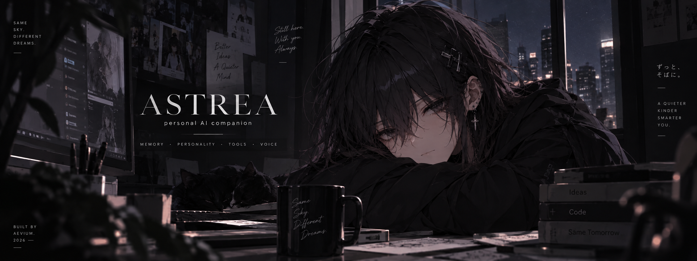

<p align="center">
  
</p> 
<div align="center">

# ASTREA ✦

### Personal AI companion

*memory · personality · tools · voice*

<br>

**Not just an assistant. Something a little more alive.**

<br>

`Python` · `PostgreSQL` · `pgvector` · `AI`

</div>

---

### About

## What is Astrea?

**Astrea** is a personal AI companion I'm building to feel persistent rather than disposable.

She can remember past interactions, maintain long-term context, use external tools, and gradually build a persistent memory of the person she interacts with.

The goal isn't just another chatbot — it's an AI companion that actually **remembers, adapts and stays with you.**

### ✦ Core systems

- 🧠 **Long-term memory** — persistent memories across conversations
- 🔎 **Semantic recall** — retrieves relevant memories when they're needed
- 🎭 **Personality** — consistent identity and behavior
- 🛠️ **Tools** — can interact with external services and systems
- 📚 **Knowledge vault** — structured personal knowledge and notes
- 🔊 **Voice** — natural voice interaction *(in development)*
- ### ✦ How Astrea works

```text
                    ┌─────────────┐
                    │     You     │
                    └──────┬──────┘
                           │
                           ▼
                    ┌─────────────┐
                    │   Astrea    │
                    │ Personality │
                    └──────┬──────┘
                           │
             ┌─────────────┼─────────────┐
             ▼             ▼             ▼
      ┌────────────┐ ┌────────────┐ ┌────────────┐
      │   Memory   │ │   Tools    │ │ Knowledge  │
      │ PostgreSQL │ │  Services  │ │  Obsidian  │
      │ + pgvector │ │    APIs    │ │   Vault    │
      └─────┬──────┘ └─────┬──────┘ └─────┬──────┘
            └───────────────┼───────────────┘
                            ▼
                     ┌────────────┐
                     │  Response  │
                     └────────────┘

### ✦ Stack

`Python` · `PostgreSQL` · `pgvector` · `Vertex AI` · `Obsidian`

---

<sub>Built by Aevium · Astrea is currently in active development.</sub>

Currently in development.

---

<sub>Created by Aevium.</sub>
